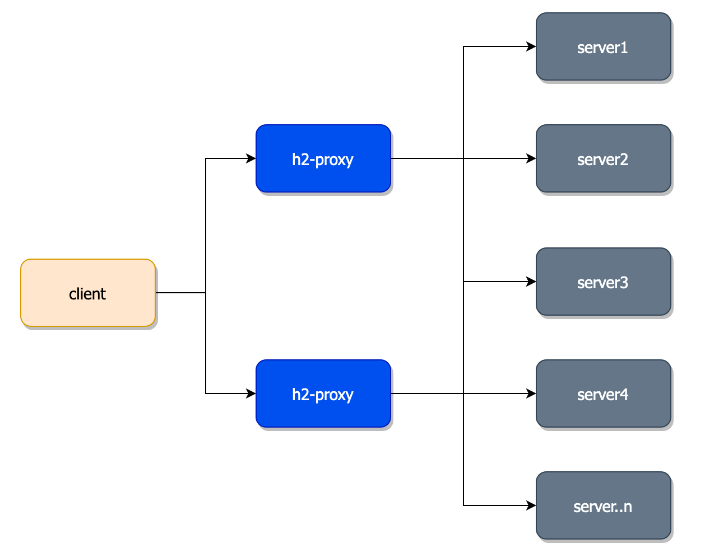

# H2-PROXY

[](https://godoc.org/github.com/cperez08/h2-proxy)
[](https://codebeat.co/projects/github-com-cperez08-h2-proxy-master)
[](https://goreportcard.com/report/github.com/cperez08/h2-proxy)
[](https://codecov.io/gh/cperez08/h2-proxy)

H2-Proxy is a light way proxy yet useful for proxying http2 and gRPC traffic

# Table of Contents
- [H2-PROXY](#h2-proxy)
- [Table of Contents](#table-of-contents)
  - [Features](#features)
    - [Connection](#connection)
    - [Load balancing](#load-balancing)
        - [Algorithms available](#algorithms-available)
    - [Domain Refresh](#domain-refresh)
  - [Configuration](#configuration)
    - [YAML configuration](#yaml-configuration)
    - [Configuration by environment variables](#configuration-by-environment-variables)
  - [Launch](#launch)
    - [Offical Docker image](#offical-docker-image)
    - [Customer Docker file](#customer-docker-file)
    - [Binary](#binary)
  - [Bonus](#bonus)
  - [Usage with gRPC + Kuberentes](#usage-with-grpc--kuberentes)
  - [Graphical representation](#graphical-representation)
  - [TODOs](#todos)


## Features

### Connection
h2-proxy supports http2 and gRPC servers/clients for proxying the request/responses, so far without support for SSL (in TODO list).

### Load balancing
The proxy is able to balance the requests against the target defined (if there are multiple IP associated with the same domain) according to the load balancing algorithm defined. Before returning any connection the balancer makes sure the connection selected is active, otherwise, a maximum of 10 retries is done before returning an error. 

##### Algorithms available
- none (default): No balancer means that h2-proxy grabs from the connection pool the first available connection, always in the same order the connections were stored.
- random: grabs in a random way any of the available connections.
- round_robin: based in the round-robin algorithm pick an available connection from the pool.

### Domain Refresh
The domain refresh helps the proxy to have the latest status of the domain, is useful to keep the load balancer up to date when instances are created, rotated, or deleted.

The domain refresh is enabled by configuration but also depends if the target is a domain in case of IP it is disabled automatically, also there is a configuration for the refresh rate where the default value is 60 seconds.

## Configuration
h2-proxy can be set up in two ways via yaml file or environment variables

### YAML configuration
If yaml configuration wants to be used then the file needs to be placed inside `/etc/h2-proxy/config.yaml` or set the env var `H2_PROXY_CFG_LOCATION` for a new location.

```yaml
proxy_address: '0.0.0.0:50060'
proxy_name: 'h2-proxy'
target_host: '127.0.0.1'
target_port: '50051'
idle_timeout: 300
print_logs: true
compact_logs: true
dns_config:
  refresh_rate: 45
  need_refresh: true
  balancer_alg: round_robin
```

- `proxy_address:` proxy address is the interface and the port the proxy will be listening on, for docker the ports exposed by the container are 8080 8090 50060 50061, default value is `0.0.0.0:50060`
- `proxy_name`: is the proxy name, default value is `h2-proxy` this name will be sent in the `X-Proxied-By` header
- `target_host:` is the server host you want to redirect the call to, this value is mandatory
- `target_port:` is the target server port, this value is mandatory
- `idle_timeout:` is the time in seconds the proxy will keep the connection alive if does not receive any request, default value is 300 (5 minutes) 
- `print_logs:` indicates if want basic logs to be printed, so far a very basic functionality is enabled and the logs arenprinted in stdout, default value is `false`
- `compact_logs:` indicates if some values are shortened when the log is printed to help to reduce the log size

logs with compact logs disabled:

```log
2020/01/01 10:10:55 {"rq_id": "c1824516-48e9-4540-9ca3-8720754e145e", "rq_path": "/user.UserService/CreateUser", "rq_proto": "HTTP/2.0", "elapsed_time_ms": 2, "rq_length": 58, "rs_length": 256}
```
logs with compact logs enabled:

```log
2020/01/01 10:10:14 id:4ef01a36-2ba6-4922-9519-cf63567d68f1 | p: /user.UserService/CreateUser | pr: HTTP/2.0 | ms: 2 | rq_ln: 58 | rs_ln: 256
```

- `dns_config.refresh_rate:` value in seconds that indicates how often the resolver needs to check the domain in order to update the set of IPs associated with one domain, default value 60 seconds
- `dns_config.need_refresh:` useful to disable the domain refresh feature, default value is true but in case the target is an IP then this value is set as false
- `dns_config.balancer_alg:` indicates the load balancing algorithm, the default value is none, possible values are: none, random and round_robin. 

### Configuration by environment variables

In the case the default values in the YAML suits all the needs then a configuration by environment variables can be done.

If YAML file is not provided the next environment variables are required:

- `H2_PROXY_TARGET_HOST`  - host where the proxy needs to redirect the calls
- `H2_PROXY_TARGET_PORT`  - target port
- `H2_PROXY_PRINT_LOGS`   - optional value that indiates if want logs to be printed
- `H2_PROXY_COMPACT_LOGS` - an optional value that indicates if some keys can be shortened in the logs

## Launch

After defining the [configuration](#configuration) strategy is time to start up the project:

### Offical Docker image

pull the docker image `docker pull cperez08/h2-proxy` then `docker run -d --name h2-proxy -p 50060:50060 -e H2_PROXY_TARGET_HOST=127.0.0.1 -e H2_PROXY_TARGET_PORT=8080 -e H2_PROXY_PRINT_LOGS=true cperez08/h2-proxy`

change the values for the real ones

### Customer Docker file

```docker
FROM cperez08/h2-proxy
COPY config.yaml /etc/h2-proxy/config.yaml
```

`docker build -t my-h2-proxy .`

`docker run -d --name h2-proxy -p 50060:50060 my-h2-proxy`

### Binary

download the binary via go get, for this option make sure you have your `$GOPATH/bin` set up in your PATH otherwise copy and paste from that location the binary into the desired destination.

- downlaod `go get -u github.com/cperez08/h2-proxy`
- run `h2-proxy` (in case the `$GOPATH/bin` is set up in PATH
- cp `$GOPATH/bin/h2-proxy` my-location/ &&  `./my-location/h2-proxy`

remember either load the environment variables and/or place the config file in an appropriate location.

## Bonus

## Usage with gRPC + Kuberentes
In order to proxy gRPC services properly inside a Kubernetes cluster follow these steps:

- Set up the gRPC server, then deploy and create a headless service.
- Set up the proxy to create the deployment and service.
- Set up the client gRPC pointing to the proxy, also you need to set up the client in a way this can balance the requests to the different proxy instances, for this support you can follow this [guideline](https://github.com/cperez08/dm-resolver) which explains how to set up properly the client gRPC based in a custom resolver (the one used in this project)
- Test and start testing with requests

__note: the most important part of this set up is the [headless service](https://kubernetes.io/docs/concepts/services-networking/service/#headless-services)__ that needs to be done for the server and for the proxy (in the aforementioned example), with this configuration Kubernetes keeps up to date all the pod's IP related to the service, so the resolver keeps in sync all the IPs where the calls need to be redirected.

## Graphical representation



## TODOs

- [ ] Add support for SSL
- [ ] Add circuit break
- [ ] Add support for multiple IPs
- [ ] Add more load balancing alghoritms
- [ ] Improve logging
